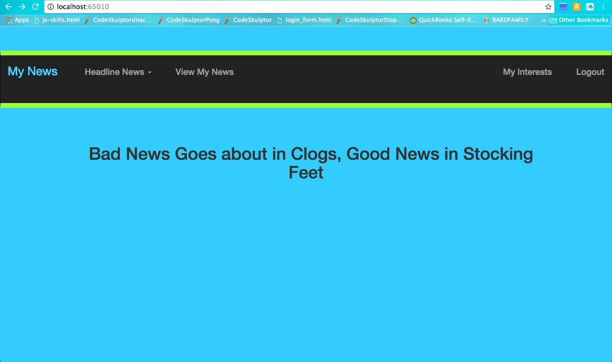
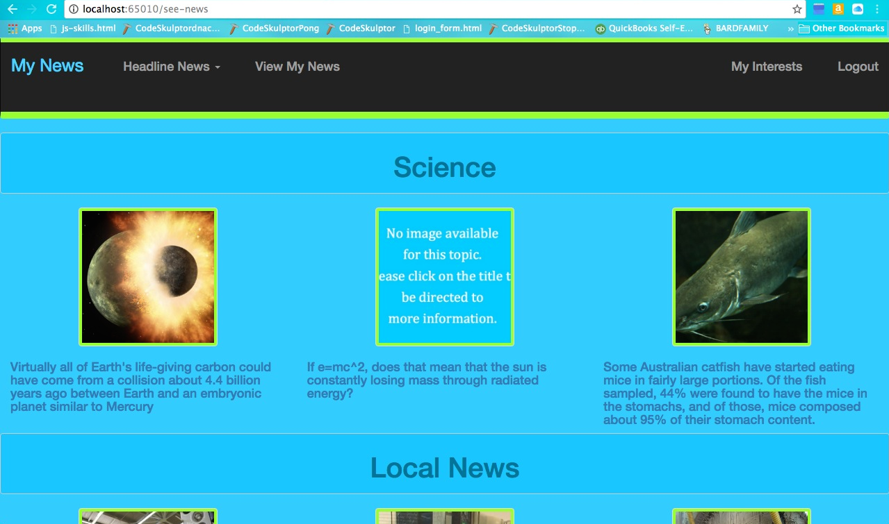
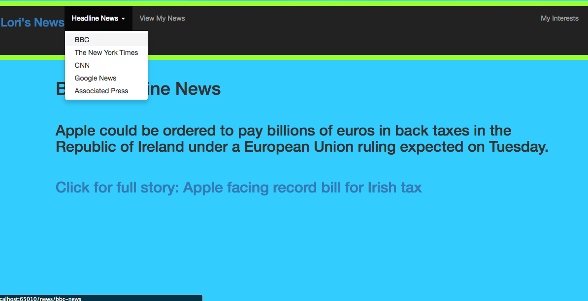

*My News*
--------------------

**My News**

My News gives users a tool to quickly preview all the news they are
interested in. Users choose from a list of possible interests and top
news articles are displayed. Also, there's a quick view of the headline
news from five major new sources (BBC, google-news, CNN, Bloomberg and
CNN). The news articles displays a thumbnail and a description. Users
can click on the article for the entire article.

**How it works**

User inputs their name and what their interests are. Through OAUTH, a
request is made to the reddit API (PRAW) to get information on the
specified interests. An Ajax call can be made to show the next three
most popular items in any category, and so on. The screen the user sees
is

Even an unregistered user can take a look at the headline news by
choosing a news source in the “Headline News” dropdown.

**Screenshots**

***Homepage***

***News for specific user based on interest. Click on category for next
three items***

***Headline News using newsapi.org***

**Testing Coverage**

As of this 9/6/2016, testing is at 78% coverage. I hope to increase the
testing coverage in the near future.

**Technology Stack**

**Application:** Python, Flask, Jinja, SQLAlchemy, PostgreSQL\
**APIs:** Reddit, Newsapi\
**Front-End**: HTML/CSS, Bootstrap, JQuery, JavaScript, AJAX

About the Developer

Lori Russell Bard
[Linkedin](https://www.linkedin.com/in/lori-bard)
